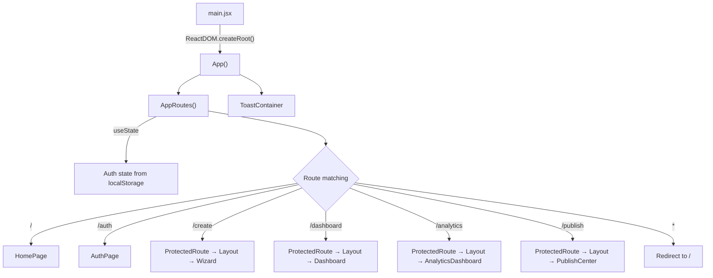
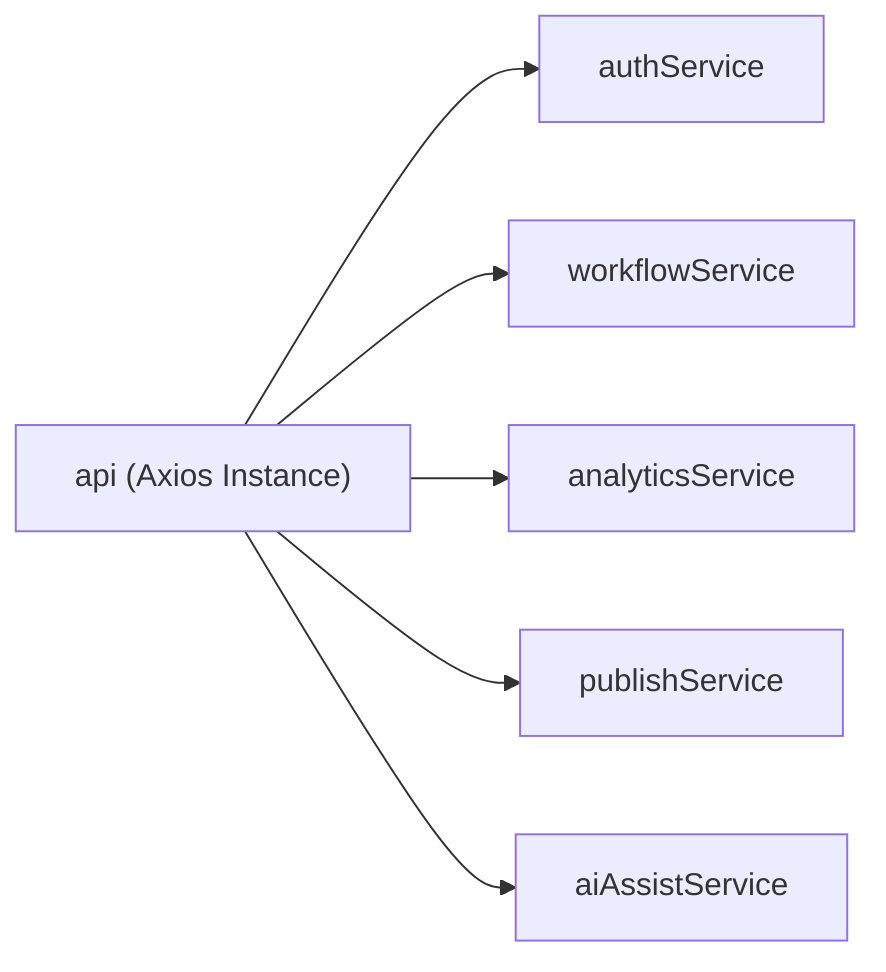
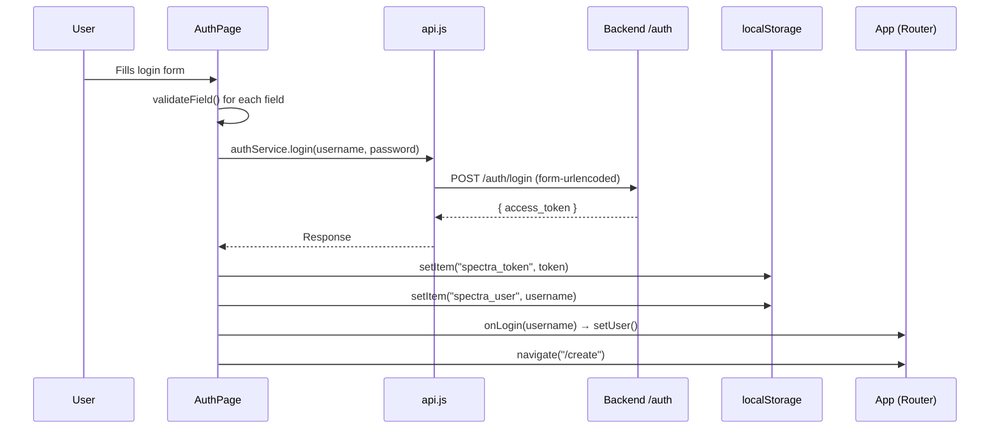
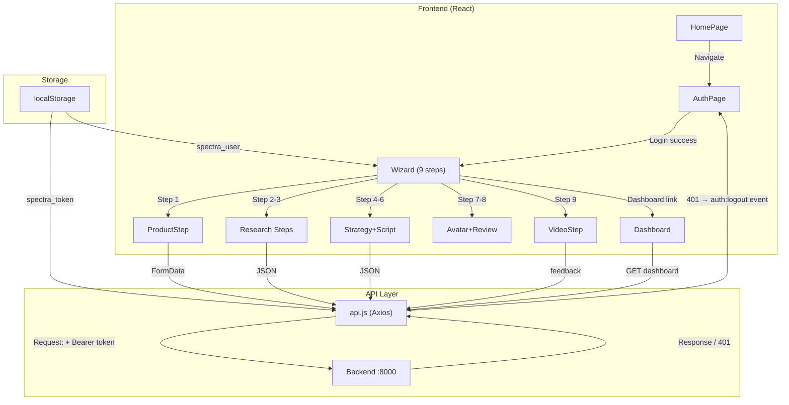

# 🎨 Spectra Frontend — Complete Code Walkthrough

A comprehensive guide explaining every file, component, and user flow in the React frontend.

---

## 1. Tech Stack & Project Structure

| Technology | Purpose |
|---|---|
| **React 18** | UI framework |
| **Vite** | Dev server & bundler |
| **React Router v6** | Client-side routing |
| **Framer Motion** | Animations & transitions |
| **Axios** | HTTP client for API calls |
| **Lucide React** | Icon library |

```
react-wizard/src/
├── App.jsx                    # Root component — routing + auth state
├── main.jsx                   # Entry point — renders <App />
├── index.css                  # Global styles
├── config/
│   ├── config.js              # Runtime config (API URL, timeouts, feature flags)
│   └── constants.js           # Step definitions, auth keys, validation rules
├── context/
│   └── AuthContext.jsx        # Auth context (currently unused)
├── services/
│   └── api.js                 # Axios instance + all API service functions
├── pages/
│   ├── HomePage.jsx           # Public landing page
│   ├── AuthPage.jsx           # Login / Signup page
│   ├── Dashboard.jsx          # Campaign & asset management
│   ├── AnalyticsDashboard.jsx # Campaign analytics & charts
│   └── PublishCenter.jsx      # Social media publishing
├── components/
│   ├── Toast.jsx              # Global toast notification system
│   ├── layout/
│   │   ├── Layout.jsx         # Sidebar + main content shell
│   │   └── ProtectedRoute.jsx # Auth guard for protected pages
│   ├── ui/
│   │   ├── LoadingOverlay.jsx # Fullscreen loading spinner
│   │   └── RenderProgressOverlay.jsx # Video render progress UI
│   └── wizard/
│       ├── Wizard.jsx         # 9-step wizard orchestrator
│       ├── ProductStep.jsx    # Step 1: Product details + image upload
│       ├── CurationStep.jsx   # Step 2: Curate competitor brands
│       ├── CompetitorStep.jsx # Step 3: Review research results
│       ├── StrategyStep.jsx   # Step 4: Ad strategy configuration
│       ├── PatternStep.jsx    # Step 5: Review ad pattern blueprint
│       ├── ScriptStep.jsx     # Step 6: Review & edit generated script
│       ├── AvatarStep.jsx     # Step 7: Select AI avatar
│       ├── ReviewStep.jsx     # Step 8: Final review before render
│       ├── VideoStep.jsx      # Step 9: Video preview + download
│       └── HistoryStep.jsx    # Campaign history viewer
```

---

## 2. Application Boot Flow



### [App.jsx](file:///c:/Users/ajits/Ads-Agent/react-wizard/src/App.jsx)

The **root component**. Contains two nested components:

1. **[App()](file:///c:/Users/ajits/Ads-Agent/react-wizard/src/App.jsx#194-202)** — Wraps everything in `<Router>` and renders `<ToastContainer>`.
2. **[AppRoutes()](file:///c:/Users/ajits/Ads-Agent/react-wizard/src/App.jsx#21-193)** — Inside the router, manages:
   - **Auth state** via `useState` reading `spectra_user` from localStorage
   - **`handleLogin(username)`** — Sets the user state when login succeeds
   - **`handleLogout()`** — Clears localStorage & navigates to `/`
   - **401 auto-logout** — Listens for a custom `auth:logout` window event dispatched by the API interceptor

> [!NOTE]
> Auth state is managed via **prop-drilling** (passing [user](file:///c:/Users/ajits/Ads-Agent/api/services/db_mongo_service.py#163-167), `onLogout` to child components). An `AuthContext` exists but is **not wired into the app**.

---

## 3. Configuration Layer

### [config.js](file:///c:/Users/ajits/Ads-Agent/react-wizard/src/config/config.js)

Central config object reading from Vite env vars (`VITE_*`):

| Key | Default | Purpose |
|---|---|---|
| `apiBaseUrl` | `http://localhost:8000` | Backend API URL |
| `apiTimeout` | `30000` (30s) | Default request timeout |
| `longOperationTimeout` | `300000` (5min) | Timeout for AI/render calls |
| `storageKeys.token` | `spectra_token` | localStorage key for JWT |
| `storageKeys.user` | `spectra_user` | localStorage key for username |

### [constants.js](file:///c:/Users/ajits/Ads-Agent/react-wizard/src/config/constants.js)

Shared constants:
- `WIZARD_STEPS` — Step metadata array (name + icon) — **Note:** currently unused, Wizard.jsx has its own copy
- `TOKEN_KEY` / `USER_KEY` — Auth localStorage keys (used by AuthContext)
- `USERNAME_REGEX` / `MIN_PASSWORD_LEN` / `MAX_PASSWORD_LEN` — Validation rules

---

## 4. API Service Layer

### [api.js](file:///c:/Users/ajits/Ads-Agent/react-wizard/src/services/api.js)

Creates an Axios instance with interceptors and exports 5 service objects:



**Request Interceptor** (runs before every request):
1. If body is `FormData`, removes `Content-Type` header (lets browser set multipart boundary)
2. Reads JWT from localStorage and sets `Authorization: Bearer <token>`

**Response Interceptor** (runs on every error):
1. If status is `401` AND it's NOT a login request → clears localStorage + dispatches `auth:logout` event
2. Re-throws the error for the caller to handle

#### Service Methods

| Service | Method | Backend Endpoint |
|---|---|---|
| **authService** | [signup(…)](file:///c:/Users/ajits/Ads-Agent/react-wizard/src/services/api.js#39-47) | `POST /auth/signup` |
| | [login(user, pass)](file:///c:/Users/ajits/Ads-Agent/react-wizard/src/services/api.js#47-55) | `POST /auth/login` (form-urlencoded) |
| | [getMe()](file:///c:/Users/ajits/Ads-Agent/react-wizard/src/services/api.js#55-56) | `GET /auth/me` |
| **workflowService** | [runDiscovery(data)](file:///c:/Users/ajits/Ads-Agent/react-wizard/src/services/api.js#59-60) | `POST /workflow/step/discover` |
| | [runResearch(product, brands)](file:///c:/Users/ajits/Ads-Agent/react-wizard/src/services/api.js#60-62) | `POST /workflow/step/research` |
| | [runPsychology(data)](file:///c:/Users/ajits/Ads-Agent/react-wizard/src/services/api.js#62-63) | `POST /workflow/step/psychology` |
| | [runScript(data)](file:///c:/Users/ajits/Ads-Agent/react-wizard/src/services/api.js#63-64) | `POST /workflow/step/script` |
| | [runGenerateAvatars(…)](file:///c:/Users/ajits/Ads-Agent/react-wizard/src/services/api.js#64-66) | `POST /workflow/step/avatar/generate` |
| | [runRender(data)](file:///c:/Users/ajits/Ads-Agent/react-wizard/src/services/api.js#66-67) | `POST /workflow/step/render` |
| | [runUploadAssets(id, type, fd)](file:///c:/Users/ajits/Ads-Agent/react-wizard/src/services/api.js#67-69) | `POST /workflow/upload-assets/:id/:type` |
| | [runGetDashboard()](file:///c:/Users/ajits/Ads-Agent/react-wizard/src/services/api.js#70-71) | `GET /workflow/dashboard` |
| | [submitFeedback(data)](file:///c:/Users/ajits/Ads-Agent/react-wizard/src/services/api.js#72-73) | `POST /workflow/feedback` |
| **analyticsService** | [getDashboardAnalytics()](file:///c:/Users/ajits/Ads-Agent/react-wizard/src/services/api.js#78-79) | `GET /analytics/dashboard` |
| | [trackEvent(…)](file:///c:/Users/ajits/Ads-Agent/react-wizard/src/services/api.js#79-81) | `POST /analytics/track` |
| **publishService** | [connectPlatform(…)](file:///c:/Users/ajits/Ads-Agent/react-wizard/src/services/api.js#86-88) | `POST /publish/platforms/connect` |
| | [publishAd(…)](file:///c:/Users/ajits/Ads-Agent/react-wizard/src/services/api.js#90-92) | `POST /publish/push` |
| **aiAssistService** | [runGenerateDescription(fd)](file:///c:/Users/ajits/Ads-Agent/react-wizard/src/services/api.js#96-97) | `POST /ai-assist/generate-description` |
| | [runUploadAvatar(fd)](file:///c:/Users/ajits/Ads-Agent/react-wizard/src/services/api.js#97-98) | `POST /ai-assist/upload-avatar` |

---

## 5. Authentication Flow



### [AuthPage.jsx](file:///c:/Users/ajits/Ads-Agent/react-wizard/src/pages/AuthPage.jsx)

A dual-mode page (Login / Signup) with:

- **Real-time field validation** — Username regex, password strength, email format
- **Password strength meter** — Visual bar with Weak/Fair/Good/Strong levels
- **Show/hide password** toggle
- **Error handling** — Network errors, 500, 503, 429, and backend validation messages
- **Parallax effects** — Mouse-tracking gradient blobs using Framer Motion springs
- **Animated brand section** — Letter-by-letter "SPECTRA" animation on the right panel

**Signup flow:** After successful signup, auto-switches to login mode with username pre-filled.

### [ProtectedRoute.jsx](file:///c:/Users/ajits/Ads-Agent/react-wizard/src/components/layout/ProtectedRoute.jsx)

Simple auth guard:
```jsx
const token = localStorage.getItem('spectra_token');
if (!token) return <Navigate to="/auth" replace />;
return children;
```
Only checks if a token **exists** — does NOT validate it.

---

## 6. Layout System

### [Layout.jsx](file:///c:/Users/ajits/Ads-Agent/react-wizard/src/components/layout/Layout.jsx)

Wraps all protected pages. Provides:

- **Sidebar navigation** (280px wide) with 4 nav items:
  - Create (`/create`) → Wizard
  - Dashboard (`/dashboard`) → Campaign list
  - Analytics (`/analytics`) → Charts & metrics
  - Publish (`/publish`) → Social publishing
- **Active tab indicator** — Animated pill using Framer Motion `layoutId`
- **User profile card** — Shows username + active status dot
- **Logout button** — Calls `onLogout` prop
- **Responsive** — Sidebar collapses to 70px icon-only mode below 768px

```
┌──────────────────────────────────────────────┐
│ SIDEBAR (280px)  │  MAIN CONTENT AREA        │
│                  │                            │
│  ⚡ SPECTRA      │  {children}                │
│  AI Ad Studio    │  (Wizard / Dashboard /     │
│                  │   Analytics / Publish)      │
│  ✨ Create       │                            │
│  📊 Dashboard    │                            │
│  📈 Analytics    │                            │
│  📤 Publish      │                            │
│                  │                            │
│  ──────────────  │                            │
│  👤 username     │                            │
│  🔴 Logout       │                            │
└──────────────────────────────────────────────┘
```

---

## 7. The Wizard — Core Campaign Creation Flow

### [Wizard.jsx](file:///c:/Users/ajits/Ads-Agent/react-wizard/src/components/wizard/Wizard.jsx)

The heart of the app. A **9-step wizard** that orchestrates the entire ad creation pipeline:

```mermaid
graph LR
    S1["1. Product"] -->|Discovery API| S2["2. Curate"]
    S2 -->|Research API| S3["3. Research"]
    S3 -->|Manual| S4["4. Strategy"]
    S4 -->|Psychology API| S5["5. Pattern"]
    S5 -->|Script API| S6["6. Script"]
    S6 -->|Manual| S7["7. Avatar"]
    S7 -->|Manual| S8["8. Review"]
    S8 -->|Render API| S9["9. Video"]
```



#### Central State Object

```javascript
state = {
  product: {},           // Brand name, description, images, features, ad_length
  curatedBrands: [],     // Competitor brands selected by user
  strategy: {},          // Funnel stage, emotions, platform, brand voice
  research: null,        // { understanding, competitors[] }
  blueprint: null,       // { pattern_blueprint, campaign_psychology }
  script: null,          // { scenes[] } — each scene has voiceover, intent
  avatar: {              // Avatar preferences
    style: 'Professional',
    gender: 'Female',
    language: 'Hindi/English Mixed'
  },
  renderResult: null,    // Final video URL
  renderFailed: false    // Render failure flag
}
```

#### Step-by-Step Breakdown

| Step | Component | What Happens | API Call |
|---|---|---|---|
| **1. Product** | [ProductStep](file:///c:/Users/ajits/Ads-Agent/react-wizard/src/components/wizard/ProductStep.jsx#7-531) | User enters brand name, product name, description, images, logo, features, ad length, product URL. Can use AI to auto-generate description from uploaded images. | `aiAssistService.runGenerateDescription()` (optional) |
| **2. Curate** | `CurationStep` | Shows AI-discovered competitor brands. User selects/deselects which to analyze. | — |
| **3. Research** | `CompetitorStep` | Shows scraped competitor ad data (Meta Ads DNA). User reviews insights. | — |
| **4. Strategy** | `StrategyStep` | User configures: funnel stage (cold/warm/hot), primary emotions, trust signals, brand voice, target platform. | — |
| **5. Pattern** | `PatternStep` | Shows AI-generated ad pattern blueprint (hook type, tone, angle, CTA, scene flow). Editable. | — |
| **6. Script** | `ScriptStep` | Shows generated scene-by-scene script. Each scene has voiceover text, editable in-place. | — |
| **7. Avatar** | `AvatarStep` | User selects AI avatar style, gender, and language. Can upload custom avatars. | — |
| **8. Review** | `ReviewStep` | Final summary of all selections before rendering. | — |
| **9. Video** | [VideoStep](file:///c:/Users/ajits/Ads-Agent/react-wizard/src/components/wizard/VideoStep.jsx#6-522) | Shows rendered video with download, TTS narration, Shop Now overlay, and feedback form. | — |

#### Transition Logic ([handleNext](file:///c:/Users/ajits/Ads-Agent/react-wizard/src/components/wizard/Wizard.jsx#49-211))

```
Step 1 → 2: Upload logo/images → call runDiscovery() → get competitor brands
Step 2 → 3: Call runResearch() → scrape Meta Ads for selected brands
Step 3 → 4: Auto-populate strategy defaults from product features
Step 4 → 5: Call runPsychology() → generate pattern blueprint
Step 5 → 6: Call runScript() → generate scene-by-scene script
Step 6 → 7: Direct navigation (no API)
Step 7 → 8: Direct navigation (no API)
Step 8 → 9: Call runRender() → generate video with HeyGen
Step 9: "Start New" reloads the page
```

---

### Key Wizard Step Components

#### [ProductStep.jsx](file:///c:/Users/ajits/Ads-Agent/react-wizard/src/components/wizard/ProductStep.jsx)
- Two-column grid form for product details
- **Logo upload** — Click-to-upload with preview, stored as `product_logo` (blob URL) + `product_logo_file` (File object)
- **Product images** — Multi-file upload with horizontal scrollable preview list, each removable
- **AI Description Generator** — Button sends uploaded images to `/ai-assist/generate-description` via `FormData`, fills description textarea
- **Ad Length selector** — Dropdown: 15s/30s/45s/60s

#### [VideoStep.jsx](file:///c:/Users/ajits/Ads-Agent/react-wizard/src/components/wizard/VideoStep.jsx)
- Video player with controls
- **Shop Now overlay** — Appears when video ends, links to `productUrl`
- **TTS narration** — Uses Web Speech API to read voiceover text synchronized to video timeline
- **Download** — Fetches video as blob → creates download link
- **Star rating + feedback** — 1-5 star rating with optional text feedback, posted to `/workflow/feedback`

---

## 8. Pages

### [HomePage.jsx](file:///c:/Users/ajits/Ads-Agent/react-wizard/src/pages/HomePage.jsx)

Public landing page with:
- Fixed navbar (SPECTRA logo + Login / Get Started buttons)
- Hero section with animated badge, title, and CTA buttons
- 6-card feature grid (AI Strategy, Smart Targeting, Competitor Research, Creative Studio, Video Production, Analytics)
- 4-step "How It Works" section
- Stats section (10K+ Ads, 3.5x Conversion, 85% Time Saved)
- Bottom CTA section
- Floating animated gradient blobs

### [Dashboard.jsx](file:///c:/Users/ajits/Ads-Agent/react-wizard/src/pages/Dashboard.jsx)

Post-login hub with:
- **Welcome hero** — User avatar + greeting + "New Campaign" button
- **Stats row** — 4 stat cards (Campaigns, Assets, Avatars, Videos)
- **Tab navigation** — Campaigns | Logos | Products | Avatars
- **Campaign list** — Card grid showing brand name, product, platform, funnel stage, video badge
- **Campaign detail view** — Click a card to see: product overview, strategy blueprint, storyboard/script, visual assets, avatar config, generated video player
- **Asset tabs** — Grid views for uploaded logos, product images, and AI avatars

### [AnalyticsDashboard.jsx](file:///c:/Users/ajits/Ads-Agent/react-wizard/src/pages/AnalyticsDashboard.jsx)

Analytics page with campaign selection + metrics visualization.

### [PublishCenter.jsx](file:///c:/Users/ajits/Ads-Agent/react-wizard/src/pages/PublishCenter.jsx)

Social media publishing page — connect platforms (Instagram, Facebook, YouTube, TikTok), select campaigns, and push ads.

---

## 9. Shared Components

### [Toast.jsx](file:///c:/Users/ajits/Ads-Agent/react-wizard/src/components/Toast.jsx)
Global toast notification system. Exports a `toast(message, type)` function. Renders toasts as stacked cards with auto-dismiss.

### [LoadingOverlay.jsx](file:///c:/Users/ajits/Ads-Agent/react-wizard/src/components/ui/LoadingOverlay.jsx)
Fullscreen semi-transparent overlay with animated spinner + customizable message. Used during all wizard API calls.

### [RenderProgressOverlay.jsx](file:///c:/Users/ajits/Ads-Agent/react-wizard/src/components/ui/RenderProgressOverlay.jsx)
Specialized overlay for Step 8 (render). Shows scene-by-scene progress animation with staggered checkmarks.

---

## 10. Data Flow Diagram — End to End



---

## 11. Styling Architecture

All components use **inline `<style>` JSX blocks** (CSS-in-JS strings). No external CSS framework.

**Design System:**
- Dark theme with deep purple/indigo gradients (`#0a0a1f`, `#1e1b4b`, `#312e81`)
- Accent colors: Indigo (`#6366f1`), Purple (`#a855f7`), Pink (`#ec4899`)
- Glassmorphism effects: `backdrop-filter: blur()`, semi-transparent backgrounds
- Micro-animations: Framer Motion for page transitions, hover effects, and loading states
- Responsive breakpoints at `1024px` and `768px`
