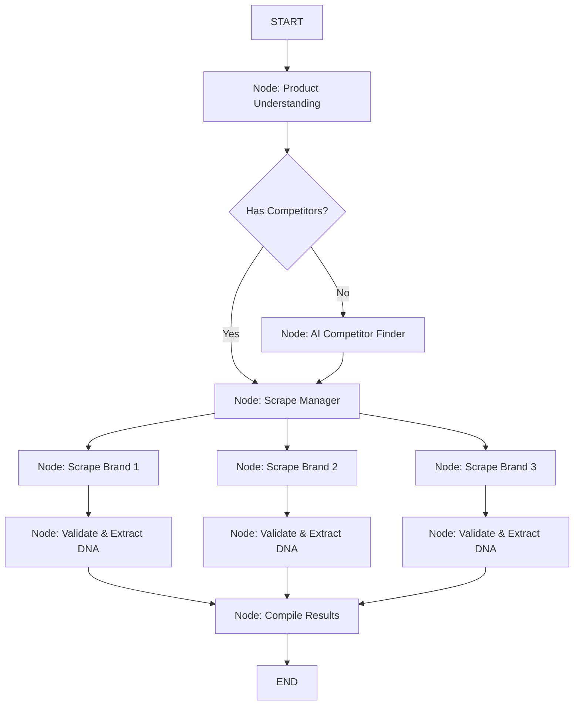
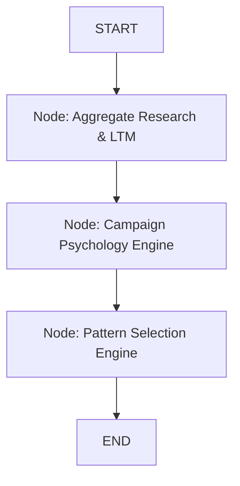
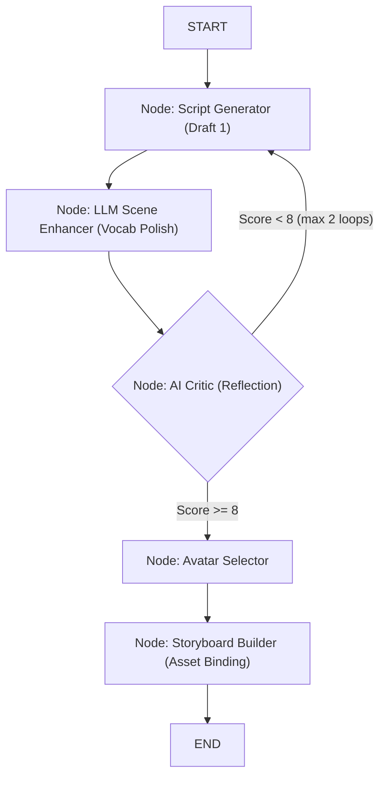
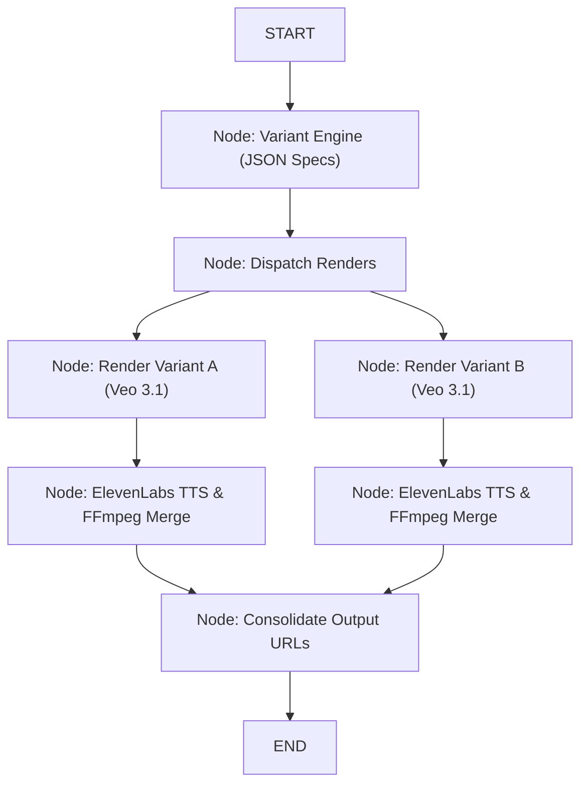

# LangGraph Agentic Architecture: Advantages, Disadvantages & Sub-Graph Implementation

When deciding whether to turn the purely linear python code *inside* your agents into **Nested LangGraphs** (Sub-Graphs), there are major tradeoffs to consider.

## ⚖️ Advantages vs. Disadvantages

### The Advantages of "LangGraphing" Every Agent
1. **Self-Correction Loops**: You can use conditional edges to route bad outputs back to previous steps (e.g., if a script gets a bad score, loop it back to the writer automatically).
2. **Micro-Checkpoints & Crash Recovery**: If the system crashes during the 5th video render, a LangGraph checkpointer will resume from video 5. A linear script will force you to restart all 5 videos.
3. **Parallel Execution**: LangGraph can easily run nodes in parallel (e.g., scraping 10 competitors at the exact same time instead of sequentially).
4. **Human-in-the-Loop**: You can pause a sub-graph mid-execution, ask the user to approve a specific scene, and then resume.

### The Disadvantages
1. **High Complexity**: It turns simple 50-line Python scripts into complex state-management puzzles.
2. **Slower Prototyping**: Passing data explicitly through a `StateDict` between 5 different micro-nodes requires strict type-checking and schema updates every time you want to pass a new variable.
3. **"State Bloat"**: Without careful state reduction algorithms, the MongoDB Checkpointer will save massive amounts of duplicate memory history every few seconds.

---

## 🏛️ Implementation: Every Agent as a Sub-Graph

If you convert the internal mechanics of your current agents into their own LangGraphs, the architecture would look like the diagrams below.

### 1. Research Sub-Graph
*Uses parallel execution to scrape multiple competitors simultaneously.*

### 2. Strategy Sub-Graph
*A linear extraction of logic into clean, separate states.*

### 3. Creative Sub-Graph
*This uses a "Reflective Loop" — a massive advantage of LangGraph.*

### 4. Production Sub-Graph
*Features parallel rendering and distinct micro-checkpoints so a single video failure doesn't ruin the whole batch.*

