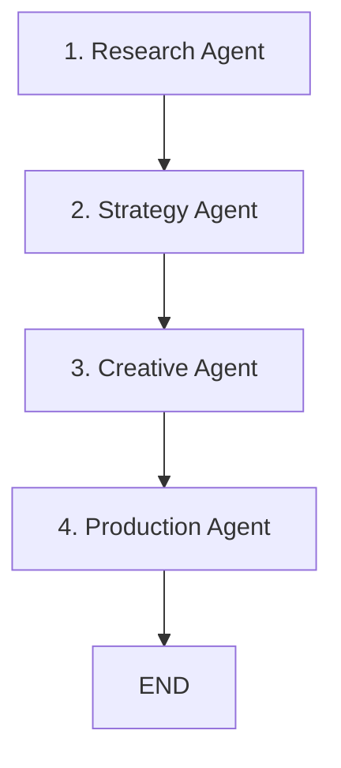

# Spectra AI - LangGraph Agentic Workflow

## Overview
The automated ad generation pipeline is entirely orchestrated using **LangGraph**. It utilizes a centralized state object (`AdGenState`) that flows through a sequence of highly specialized AI agents (nodes).

- **Framework**: LangGraph
- **Shared State**: `AdGenState` (A TypedDict storing context, inputs, and outputs across the entire run)
- **Checkpointer**: `MongoDBSaver` (Writes graph checkpoints directly to MongoDB, enabling the app to run step-by-step via the frontend UI without suffering data loss between API requests)

---

## Graph Structure (Edges & Nodes)
Defined in `agents/graph.py`, the workflow is a strict linear pipeline ensuring that strategic decisions are locked in before creative execution begins.

---

## Node Details & Internal Functions

### 1. Research Agent (`agents/research/agent.py`)
**Goal**: Understand what the product is, look at the market, and extract what is currently working for competitors.

- **`ProductUnderstandingEngine`**: Analyzes the raw user input (website URL or text description) to extract features, category, and core product identity.
- **`AICompetitorFinder`**:
  - `find_competitors()`: Uses an LLM to automatically discover rival brands if the user didn't provide any.
  - `verify_ad_match()`: Acts as a filter against scraped ads, discarding ads that don't match the current product category.
  - `refine_ad_dna()`: Extracts core psychological hooks, punchlines, and "DNA" from the competitor ad copy.
- **`run_extraction`**: Actually scrapes the Meta Ad Library to find live, active ads for the curated competitor brands.

### 2. Strategy Agent (`agents/strategy/agent.py`)
**Goal**: Define the emotional and psychological angle of the ad before writing any script.

- **`CampaignPsychologyEngine`**: Ingests the product understanding and competitor DNA. It determines the best emotional angles, specific user problems to target, objections to overcome, and trust signals (like 7-day returns or guarantees) to feature.
- **`PatternSelectionEngine`**: Takes the computed campaign psychology and selects a specific "Pattern Blueprint" (e.g., *Educational Hook*, *Problem-Agitation-Solution*). This defines the structural flow of the scenes, the tone, and text density.

### 3. Creative Agent (`agents/creative/agent.py`)
**Goal**: Write the voiceover and direct the visual flow of the commercial.

- **`ScriptGenerator`**: Translates the pattern blueprint and campaign psychology into a complete, localized voiceover script, broken down scene-by-scene.
- **`ai_assist_service.filter_storyboard_scenes_parallel`**: An asynchronous LLM polishing step that loops over the raw script scenes and enhances the vocabulary for better emotional impact and visual clarity.
- **`StoryboardBuilder`**: Takes the finalized script and binds specific visual assets (user-uploaded product images, lifestyle images, brand logos) to specific scenes. It also assigns the precise camera tracking and shot types for the AI Avatar.
- **`run_reflection_loop`**: A self-critique mechanism. An LLM reads the final script and scores it against the original psychology blueprint. If it's lacking, the agent will loop back and rewrite the script up to 2 times to improve the score.

### 4. Production Agent (`agents/production/agent.py`)
**Goal**: Render the final video, synthesize the voiceover, and compile all assets.

- **`VariantEngine`**: Prepares the storyboard output into concrete, machine-readable instructions.
- **`GeminiRenderer`**: The heavy-lifting video generation engine.
  - Generates realistic, cinematic video scenes using the **Google Veo 3.1** model based on the storyboard's visual directives.
  - Uses **FFmpeg** to physically stretch or trim the generated clips to perfectly match the allocated scene durations (e.g., exactly 8.5 seconds).
  - Merges all the clips seamlessly using cross-fades, and applies post-processing overlays like subtle film grain and contrast grading for photorealism.
- **`ElevenLabsAudioService`**: 
  - Features an internal `_phonetic_correction` hook that intercepts Hindi/regional text and asks an LLM to rewrite it phonetically to fix pronunciation issues.
  - Generates the ultra-realistic, emotively-capable voiceover using the ElevenLabs API, which is then mapped over the generated video by FFmpeg.
